# Convolution

Toutes les image et explications sont totalement reprise de:
- The Independent Code :  [Convolutional Neural Network from Scratch | Mathematics & Python Code](https://www.youtube.com/watch?v=Lakz2MoHy6o)
- 3Blue1Brown : [Backpropagation calculus | Chapter 4, Deep learning](https://www.youtube.com/watch?v=tIeHLnjs5U8)


## Cross-Correlation (appeler convolution par abut de language)
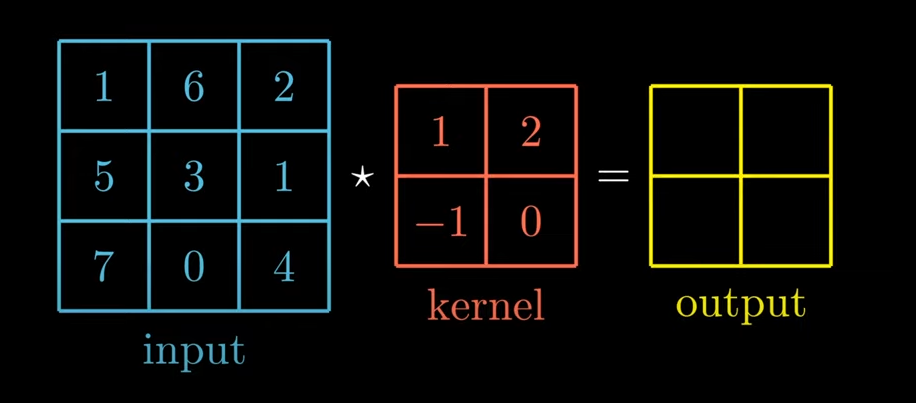

Calacule de la matrice de sortie:

La version Classique:

$$O = I-K + 1$$

La version avancé prenant en compte le Stride et Padding

$$ O_h = \frac{I_h - K_h + 2P_h}{S_h} + 1 $$

$$ O_w = \frac{I_w - K_w + 2P_w}{S_w} + 1 $$

Où: 
- $I_h$: Hauteur de l'entrée
- $I_w$: Largeur de l'entrée
- $K_h$: Hauteur du filtre (kernel)
- $K_w$: Largeur du filtre (kernel)
- $S_h$: Stride vertical
- $S_w$: Stride horizontal
- $P_h$: Padding vertical
- $P_w$: Padding horizontal

## Convolution
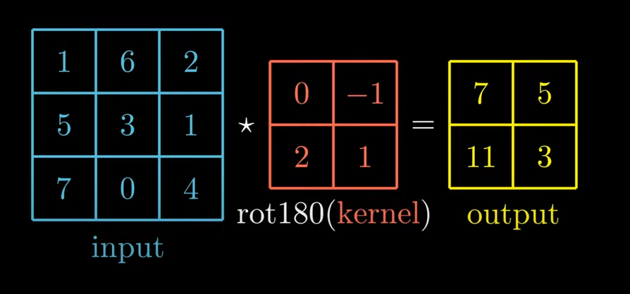

$\star$ -> Cross-Correlation

$*$ -> Convolution

Donc la convolution est :
$$ I * K = I \star rot180(K) $$

## Full correlation

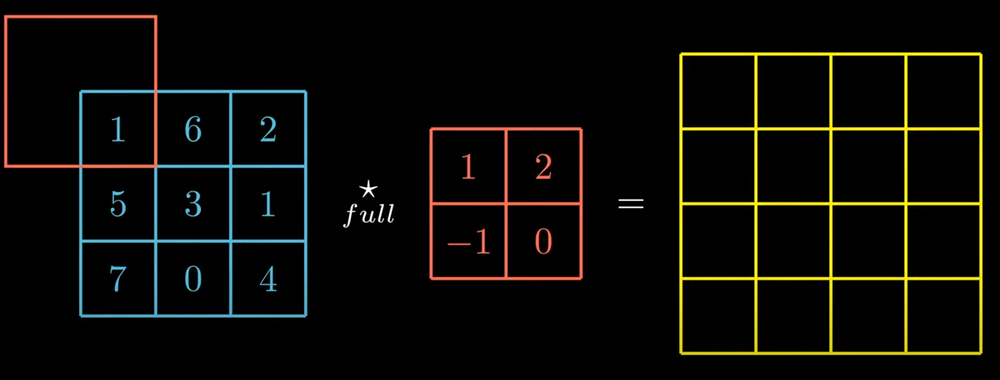

# Convolutional Layer
Image RGB -> Trois dimmenstions (n dimension = 3)

Nombre de paramètre $K_h*K_w*n + 1$  le '$+1$' correspond au biais

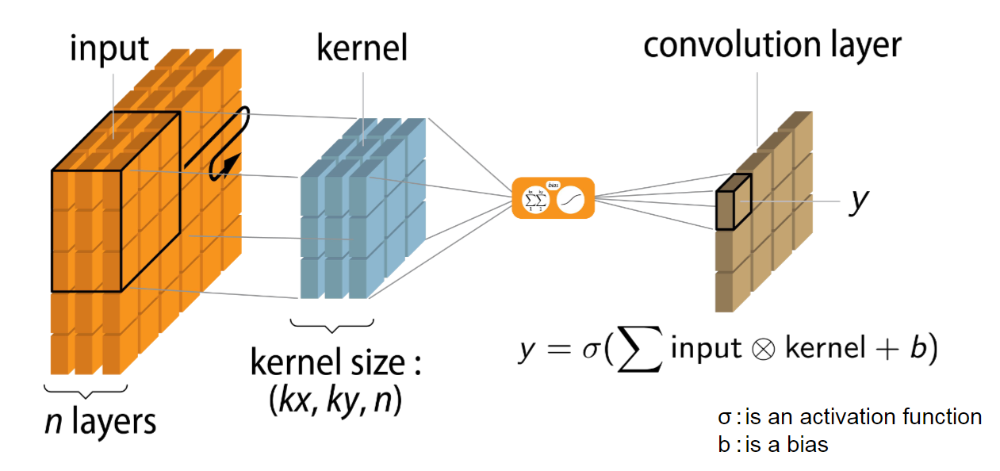
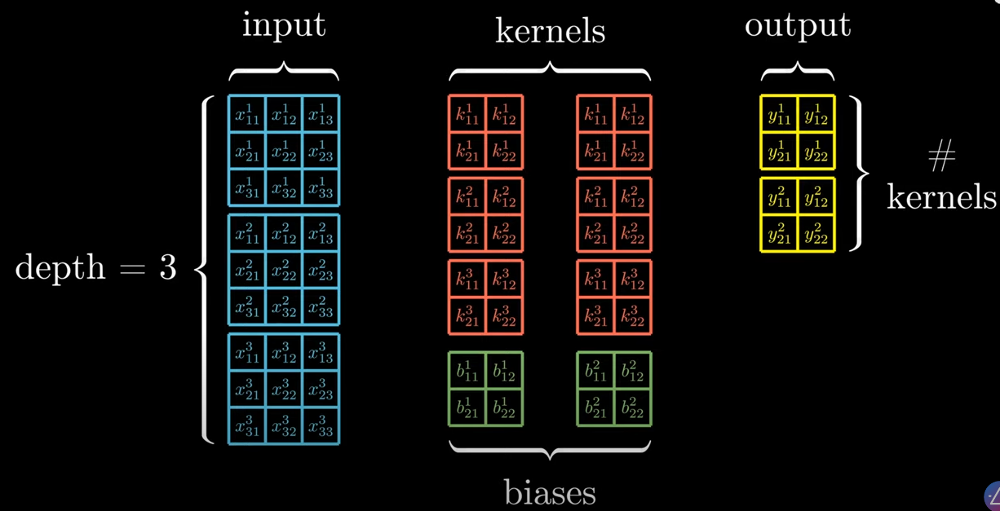
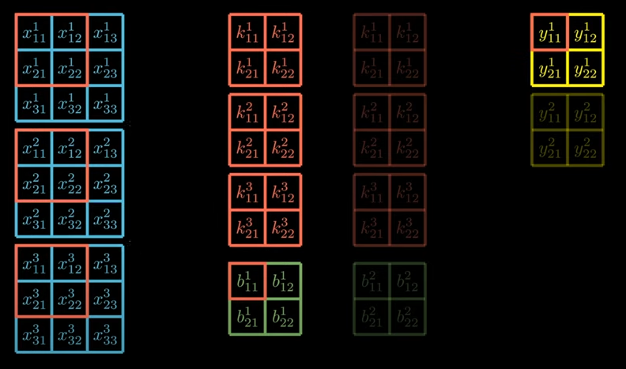

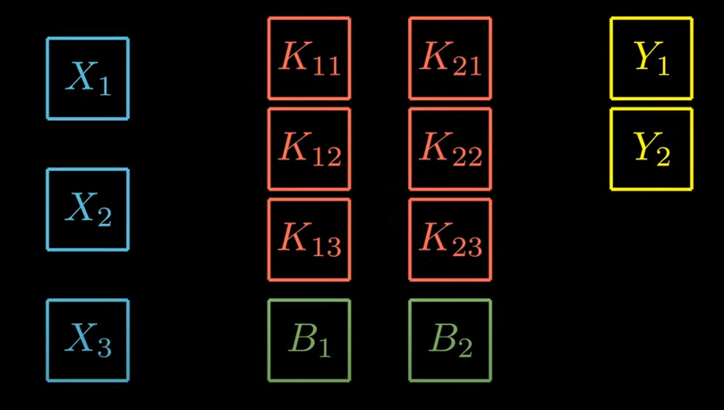
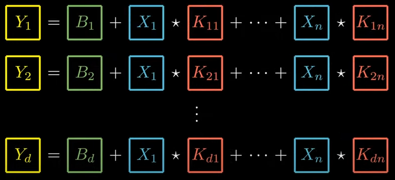

$$Y_i = B_i + \sum_{j=1}^{n} X_j \star K_{ji} $$

```Python
class Layer:
    def __init__(self):
        self.input = None
        self.output = None

    def forward(self, input):
        pass

    def backward(self, output_gradient, learning_rate):
        pass
```
```Python
import numpy as np
from scipy import signal
from layer import Layer
```
```Python
class Convolutional(Layer):
    def __init__(self, input_shape, kernel_size, depth):
        input_depth, input_height, input_width = input_shape
        self.depth = depth
        self.input_shape = input_shape
        self.input_depth = input_depth
        self.output_shape = (depth, input_height - kernel_size + 1, input_width - kernel_size + 1)
        self.kernels_shape = (depth, input_depth, kernel_size, kernel_size)
        self.kernels = np.random.randn(*self.kernels_shape)
        self.biases = np.random.randn(*self.output_shape)
```
## Forward 

$$Y_i = B_i + \sum_{j=1}^{n} X_j \star K_{ji} $$

```Python
def forward(self, input):
        self.input = input
        self.output = np.copy(self.biases)
        for i in range(self.depth):
            for j in range(self.input_depth):
                self.output[i] += signal.correlate2d(self.input[j], self.kernels[i, j], "valid")
        return self.output
```

## Back propagation

Calcule du gardien de l'erreur, donc la dérivé de l'erreure par rapport aux paramètres b, w, k

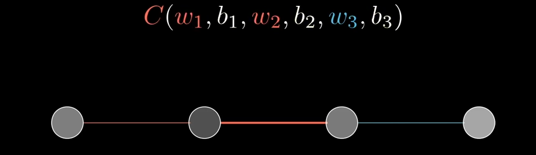
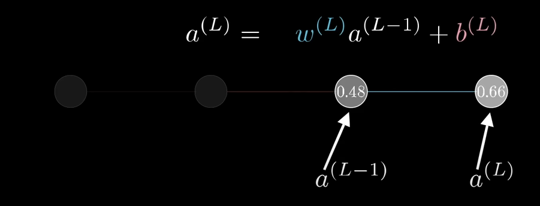
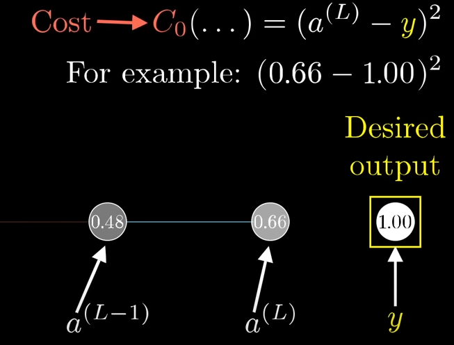


Ajout de la fonction d'activation :

$$\sigma = ReLU$$

$$a^{(L)} = \sigma (w^{(L)}a^{(L-1)}+b^{(L)})$$

On retrouve notre formule :

$$\^Y = \sigma(B + X \star K)$$

On va donner un nom à somme pondéré :

$$z^{(L)} = w^{(L)}a^{(L-1)}+b^{(L)}$$

Donc :

$$a^{(L)} = \sigma (z^{(L)})$$

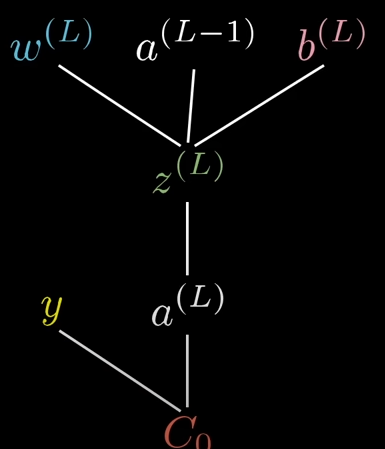
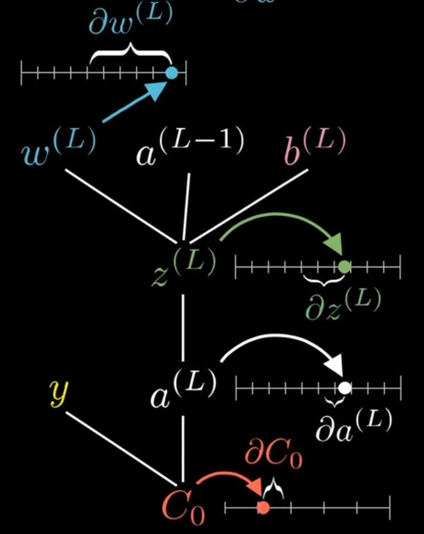

### Chain rule :
Quelle est la dérivé de C par rapport à $w^L$

$${\delta C_0\over \delta w^{(L)}} = {\delta z^{(L)} \over \delta w^{(L)}} {\delta a^{(L)} \over \delta z^{(L)}} {\delta C_0\over \delta a^{(L)}}$$
.

where : 
$$C_0 = (a^{(L)}-y)^2$$  

$${\delta C_0\over \delta a^{(L)}} = 2(a^{(L)}-y)$$

where : 
$$a^{(L)} = \sigma (z^{(L)})$$ 

$${\delta a^{(L)} \over \delta z^{(L)}} = \sigma' (z^{(L)})$$

where : 
$$z^{(L)} = w^{(L)}a^{(L-1)}+b^{(L)}$$  

$${\delta z^{(L)} \over \delta w^{(L)}} = a^{(L-1)}$$

Soit:
$${\delta C_0\over \delta w^{(L)}} =a^{(L-1)} \sigma' (z^{(L)}) 2(a^{(L)}-y)$$

**Ca, c'est pour les poids !** Maintenant les Biais :

$${\delta C_0\over \delta b^{(L)}} = 1 \sigma' (z^{(L)}) 2(a^{(L)}-y)$$

$${\delta C_0\over \delta b^{(L)}} = {\delta z^{(L)} \over \delta b^{(L)}} {\delta a^{(L)} \over \delta z^{(L)}} {\delta C_0\over \delta a^{(L)}}$$

Et pareil pour la précédente activation:

$${\delta C_0\over \delta a^{(L-1)}} = w^{(L)} \sigma' (z^{(L)}) 2(a^{(L)}-y)$$

$${\delta C_0\over \delta a^{(L-1)}} = {\delta z^{(L)} \over \delta a^{(L-1)}} {\delta a^{(L)} \over \delta z^{(L)}} {\delta C_0\over \delta a^{(L)}}$$

.

Enfin cela appliqué sur un réseau normal, avec de multiple neuronnes :
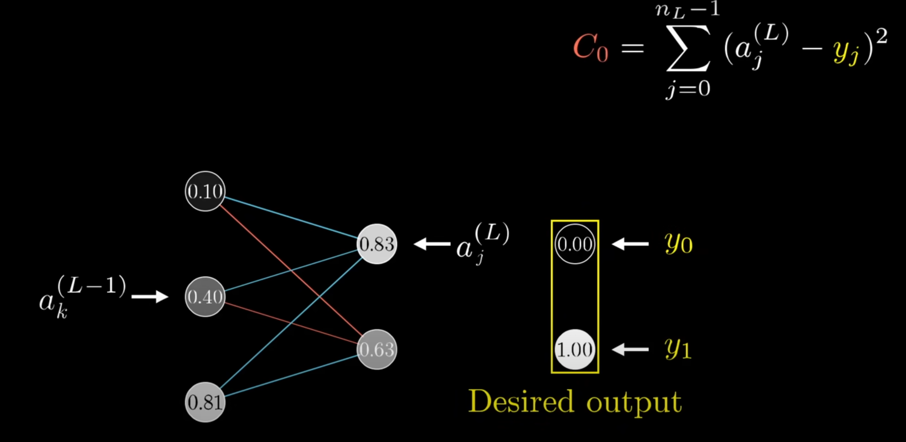

### Backward bias
$${\delta C_0\over \delta b^{(L)}} = {\delta z^{(L)} \over \delta b^{(L)}} {\delta a^{(L)} \over \delta z^{(L)}} {\delta C_0\over \delta a^{(L)}}$$

### Backward kernel
$${\delta C_0\over \delta w_{jk}^{(L)}} = {\delta z_j^{(L)} \over \delta w_{jk}^{(L)}} {\delta a_j^{(L)} \over \delta z_j^{(L)}} {\delta C_0\over \delta a_j^{(L)}}$$

### Backward Input
$${\delta C_0\over \delta a_k^{(L-1)}} = \sum_{j=0}^{n_{L}-1} {\delta z_j^{(L)} \over \delta a_k^{(L-1)}} {\delta a_j^{(L)} \over \delta z_j^{(L)}} {\delta C_0\over \delta a_j^{(L)}}$$

##################################
- **Input (I)** : C'est l'image d'entrée.
- **Kernel (K)** : C'est le filtre utilisé pour extraire les caractéristiques.
- **Output (O)** : C'est la carte de caractéristiques (feature map) obtenue après convolution.

## Étapes du processus de rétropropagation

Maintenant que nous avons compris la convolution, passons à la rétropropagation dans le contexte d'une couche convolutive.

### 2. Propagation avant (Forward pass)

Lors de la propagation avant, l'entrée (une image) passe à travers la couche convolutive où elle est convoluée avec un ensemble de filtres (kernels) pour produire une sortie.

$$
Y_i = B_i + \sum_{j=1}^{n} X_j \star K_{ji}
$$

- **$ Y_i $** : La sortie de la couche convolutive.
- **$ B_i $** : Le biais ajouté à chaque carte de caractéristiques.
- **$ X_j $** : Le j-ème canal de l'image d'entrée.
- **$ K_{ji} $** : Le j-ème filtre du i-ème kernel.
- **$ \star $** : La cross-correlation (ou convolution selon le contexte).

### 3. Propagation arrière (Backward pass)

La rétropropagation consiste à calculer les gradients des paramètres (kernels, biais) par rapport à la fonction de coût, et à propager ces gradients en arrière pour ajuster les paramètres.


#### a. Calcul du gradient de la sortie

Le gradient de la fonction de coût $C$ par rapport à la sortie de la couche est donné par :

$$
\delta^{(L)} = \frac{\partial C}{\partial a^{(L)}} = 2(a^{(L)} - y) \cdot \sigma'(z^{(L)})
$$

- **$ \delta^{(L)} $** : Le gradient de l'erreur par rapport à la sortie de la couche.
- **$ a^{(L)} $** : La sortie actuelle après application de la fonction d'activation.
- **$ y $** : La valeur cible (label).
- **$ \sigma'(z^{(L)}) $** : La dérivée de la fonction d'activation.

#### b. Calcul du gradient des biais

Le gradient du biais est simplement :

$$
\frac{\partial C}{\partial b^{(L)}} = \delta^{(L)}
$$

Ce gradient est appliqué à chaque biais de la couche.

#### c. Calcul du gradient des kernels (poids)

Le gradient des kernels est calculé en convoluant l'entrée avec le gradient de la sortie :

$$
\frac{\partial C}{\partial w_{jk}^{(L)}} = a^{(L-1)} \star \delta^{(L)}
$$

- **$ a^{(L-1)} $** : L'activation de la couche précédente.
- **$ \delta^{(L)} $** : Le gradient de l'erreur par rapport à la sortie.

#### d. Propagation des gradients vers l'entrée précédente

Pour propager le gradient en amont (vers la couche précédente), on effectue la convolution du gradient de la sortie avec le kernel :

$$
\delta^{(L-1)} = \delta^{(L)} \star rot180(K)
$$

- **$ rot180(K) $** : Rotation du kernel de 180 degrés (convolution classique).

Cela permet de calculer les gradients par rapport à l'entrée de la couche actuelle, nécessaires pour continuer la rétropropagation.
##################################


``` Python
def backward(self, output_gradient, learning_rate):
        kernels_gradient = np.zeros(self.kernels_shape)
        input_gradient = np.zeros(self.input_shape)

        for i in range(self.depth):
            for j in range(self.input_depth):
                # Calcul du gradient des kernels
                kernels_gradient[i, j] = signal.correlate2d(self.input[j], output_gradient[i], "valid")
                # Calcul du gradient par rapport à l'entrée (pour rétropropagation en amont)
                input_gradient[j] += signal.convolve2d(output_gradient[i], self.kernels[i, j], "full")

        self.kernels -= learning_rate * kernels_gradient
        self.biases -= learning_rate * output_gradient
        return input_gradient
```

# Exemple et chiffre

Image 24 Mega pixel -> 72 milliards de paramètres dans un dense !


Loss
$$Loss = -\sum_{i=1}^{C} y_i \log(\^y_i) $$

Accuracy 
$$Accuracy = {Nombre de prédictions correctes \over Nombre total de prédictions}$$

cross-entropy

$$
H(p,y) = - \sum_{i=1}^N y_i \cdot log(pi)
$$

$$
Cross-entropy loss = - {1 \over M} \sum_{j=1}^M \sum_{i=1}^N y_{ji} \cdot log(p_{ji})
$$
